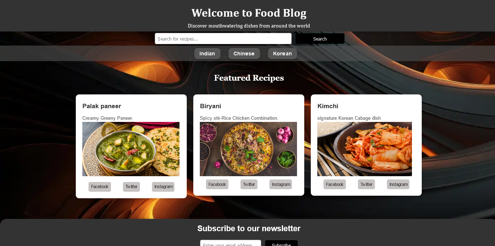

# FOOD-BLOG-SITE-SEO-ANALYSIS



Sure, here's a README template for your Food Blog project on GitHub:

---

# Food Blog Website

Welcome to the Food Blog website repository! This project is a showcase of a fictional food blog, featuring delicious dishes from Indian, Chinese, and Korean cuisines. The website aims to provide users with mouthwatering recipes, culinary inspiration, and a delightful browsing experience.

## Table of Contents

- [Introduction](#introduction)
- [Features](#features)
- [Installation](#installation)
- [Usage](#usage)
- [Contributing](#contributing)
- [License](#license)

## Introduction

The Food Blog website is a web development project created to explore various aspects of web design, front-end development, and search engine optimization (SEO). It incorporates modern design principles, responsive layouts, and engaging content to captivate users and showcase the diversity of culinary delights from different cultures.

## Features

- **Multi-cuisine Recipes:** Explore a wide range of delicious dishes from Indian, Chinese, and Korean cuisines.
- **Responsive Design:** The website is fully responsive, ensuring optimal viewing and interaction across various devices and screen sizes.
- **SEO Optimization:** Incorporates search engine optimization best practices to improve organic search visibility and attract more visitors.
- **Interactive Elements:** Engage users with interactive features such as social media sharing buttons and a poll for favorite cuisine.
- **Creative Error Page:** A custom 404 error page is included to provide users with a visually appealing and engaging experience even when encountering page not found errors.

## Installation

To run the Food Blog website locally, follow these steps:

1. Clone the repository to your local machine using the following command:

   ```bash
   git clone https://github.com/tigerhooduday/FOOD-BLOG-SITE-SEO-ANALYSIS.git
   ```

2. Navigate to the project directory:

   ```bash
   cd food-blog
   ```

3. Open the `index.html` file in your web browser.

## Usage

Feel free to explore the website and interact with its various features. You can navigate through different cuisine categories, view featured recipes, and participate in the interactive elements such as the poll for favorite cuisine.

## Contributing

Contributions are welcome! If you have any ideas for improvement, new features to add, or bug fixes, please submit a pull request or open an issue on GitHub.

## License

This project is licensed under the [MIT License](LICENSE).
